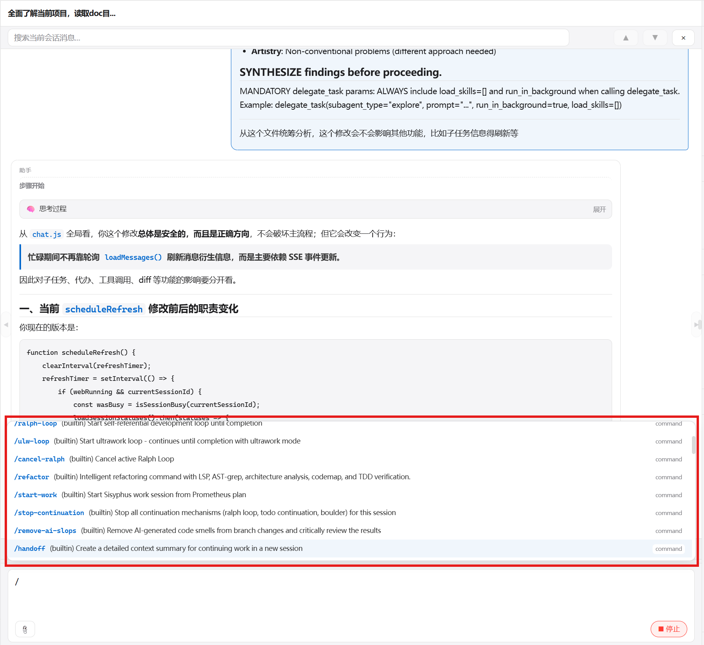

# 🧩 OC Manager

> OpenCode 全能工作台——让 AI 编程更优雅

<p align="center">
  
  
  
  
</p>

**OC Manager** 是一个精心打造的 [OpenCode](https://github.com/anomalyco/opencode) 可视化管理桌面应用。告别命令行，用直觉操作 AI。

---

## ✨ 一览

<table>
<tr>
<td width="50%">

### 🎯 一站式工作台
启动服务、管理会话、浏览项目树——**一个窗口搞定全部**。左侧项目树、中间对话区、右侧信息面板，经典三栏布局，信息密度恰到好处。

### 🎨 优雅的对话体验
用户消息右对齐蓝边气泡，AI 回复左对齐卡片。推理过程、工具调用、文件操作**智能折叠**，想看才展开。Markdown 完整渲染，代码块语法高亮。

</td>
<td width="50%">

### 📁 文件浏览器 + Git
站内文件预览、编辑、上传、删除。左侧支持**懒加载文件树**展开/折叠，右侧支持文本/代码、Markdown、HTML、图片、PDF 预览。**内置 Git 面板**——查看变更、暂存提交、推送拉取，支持代理连接。拖拽调整面板宽度。

### 📱 三端通吃
桌面端（Wails WebView2）、Web 端（内置 HTTP 服务）、手机端（自适应布局）——一套代码，随处使用。

</td>
</tr>
</table>

---

## 🔥 配置管理

<table>
<tr>
<td width="50%">

### ⚙️ OMO 模型配置
agent / category 粒度的模型映射，方案**导出·导入·入库·应用**一气呵成。JSONC 编辑器实时预览，修改即生效。

### 📡 供应商管理
一键拉取供应商模型列表，批量管理。支持自定义 API 地址和密钥。

</td>
<td width="50%">

### 📁 项目级配置管理 <sup>NEW</sup>
在项目树中点击 ⚙️ 即开——管理 `.opencode/` 下的**核心配置、技能、命令、规则、AGENTS.md**。Markdown 渲染预览，代码语法高亮，一键切换编辑。

### 🔗 技能管理
全局技能聚合扫描，冲突自动检测，一键启用/停用。**方案入库·一键切换**，支持嵌套技能。项目级技能**软链接导入**，来源目录自动识别已有和全局存在。

</td>
</tr>
</table>

---

## 🪄 更多亮点

| 🚀 功能 | 💡 说明 |
|----------|---------|
| **实时 SSE 事件流** | OpenCode 状态实时推送，服务健康一目了然 |
| **版本检测** | 服务状态栏支持一键检查 OpenCode 是否有新版本，结果以 Toast 提示 |
| **子任务面板** | 自动提取 task 工具触发的子任务，卡片式展示，点击查看详情 |
| **代办事项** | 从会话中智能提取 TODO，进行中 / 已完成分组 |
| **固定目录状态栏** | 右侧当前目录独立固定在底部，避免被上方卡片内容遮挡 |
| **文件变更 Diff** | 目录树展示，左右对照式 diff 渲染，暂存/未暂存一目了然 |
| **命令面板** | 常用 CLI/TUI 命令参考，支持搜索，`/` 键唤起 |
| **网络代理** | 代理配置一处搞定，Git 推送拉取自动走代理 |
| **暗色模式** | 深色主题一键切换，护眼编程 |
| **目录选择器** | 可视化盘符浏览，过滤隐藏/系统目录 |

---

## 📸 截图

<details open>
<summary><b>工作区</b></summary>
<p align="center">
  
  
</p>
</details>

<details>
<summary><b>会话区 · 文件树 · Markdown 输出</b></summary>
<p align="center">
  
  
  
  
</p>
</details>

<details>
<summary><b>配置管理</b></summary>
<p align="center">
  
  
  
  
</p>
</details>

<details>
<summary><b>文件管理</b></summary>
<p align="center">
  
  
  
  
</p>
</details>

---

## 🛠 构建

```bash
wails dev          # 开发模式，热重载
wails build        # 生产构建 → build/bin/oc-manager.exe
go build ./...     # 仅编译 Go 后端
go test ./...      # 运行测试
go vet ./...       # 静态检查
```

> **前置条件**：Go 1.21+ · Wails CLI · Windows WebView2

---

## 📖 使用指南

详细操作手册见 **[doc/使用说明.md](doc/使用说明.md)**

---

<p align="center">
  <sub>Made with ❤️ for the OpenCode community</sub>
</p>
