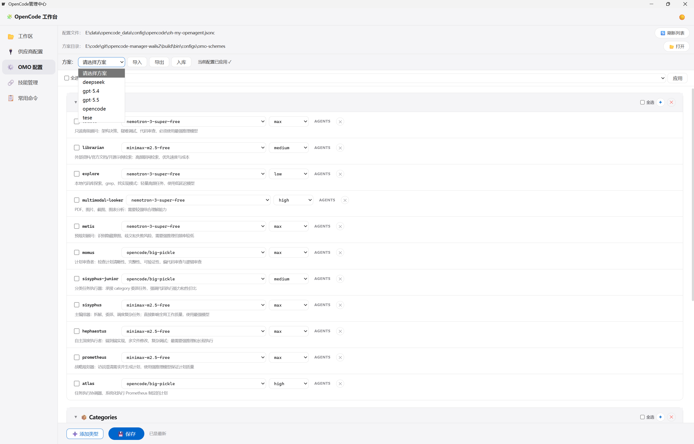
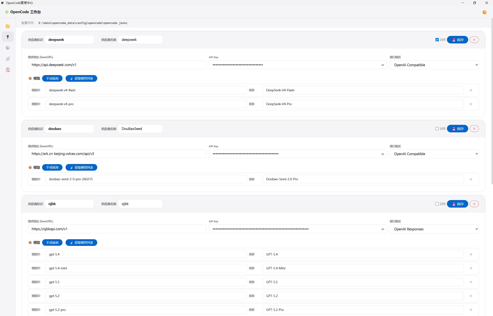
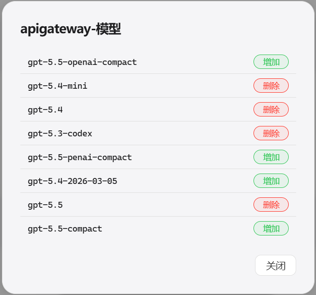
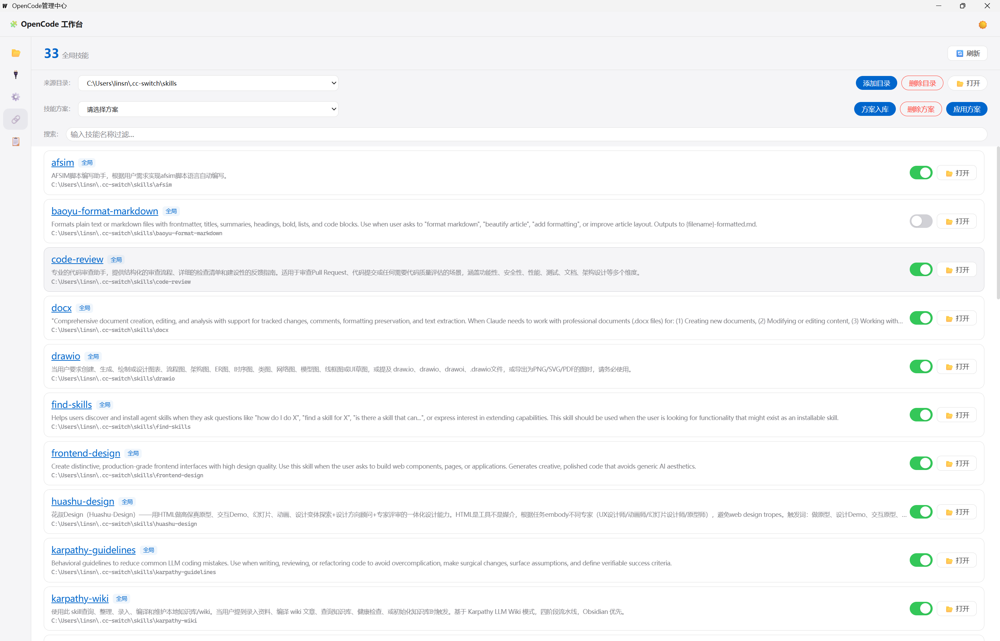

# OC Manager

Wails v2 桌面应用，为 [OpenCode](https://github.com/anomalyco/opencode) 提供可视化管理界面（三端支持：桌面端、Web 端、手机端）。

---

## 一、项目概览

| 维度 | 详情 |
|---|---|
| **名称** | OC Manager — OpenCode 可视化管理中心 |
| **框架** | Wails v2.12（Go 后端 + WebView2 / 浏览器前端） |
| **语言** | Go 1.25 + 原生 HTML/CSS/JS |
| **构建状态** | ✅ `go vet` 通过 / ✅ `go test` 通过 |
| **三端支持** | Windows 桌面（Wails） / 浏览器直接打开 / 手机端自适应 |

---

## 二、项目结构

```
opencode-manager-wails2/
├── main.go                  # Wails 入口，Go embed 前端资源
├── app.go                   # App 结构体，Wails 绑定方法（~800 行）
├── config/
│   ├── model_config.go      # 模型配置 JSONC 读写
│   ├── provider_config.go   # 供应商配置读写
│   ├── skill_config.go      # 技能源目录配置
│   ├── skill_scheme.go      # 技能方案存储
│   └── scheme_config.go     # OMO 方案管理
├── model/
│   └── types.go             # 共享数据类型
├── service/
│   ├── api.go               # OpenCode serve API 代理
│   ├── process.go           # 进程管理 + 对话框辅助
│   ├── sse.go               # SSE 事件流透传
│   ├── tree.go              # 项目树构建
│   └── dir_browser.go       # 目录浏览器
├── skill/
│   └── skill.go             # 技能管理（扫描/链接/方案应用）
├── frontend/
│   └── dist/                # 前端资源（20+ JS/CSS 模块）
├── build/
│   └── bin/                 # 构建产物 + 配置目录
├── configs/                 # 运行时配置文件
├── doc/                     # 文档 + 截图
└── wails.json
```

---

## 三、功能亮点

> 详细使用说明见 [使用说明.md](doc/使用说明.md)

### 🌐 三端支持

| 平台 | 方式 | 说明 |
|---|---|---|
| **桌面端** | `oc-manager.exe`（Wails 编译产物） | 完整功能，原生文件对话框 |
| **Web 端** | 浏览器打开 `http://host:port` | 内置 Web 服务器，mock 数据可离线预览 |
| **手机端** | 浏览器自适应（≤800px 移动布局） | Enter 换行 / 按钮发送，拖动调整输入框 |

> 
> 

### 🗂 项目树管理

一目了然的项目→目录→会话三级树形结构。查看所有历史会话，点击快速切换，支持新建 / 删除会话。鼠标悬停显示会话详情（标题、目录、最近更新时间）。

> 

### 💬 会话区友好展示

参考主流聊天软件设计，用户消息右对齐（accent 蓝边框），模型回复左对齐（卡片式）。不同类型的回复采用分类折叠展示：推理过程、文件操作、工具调用默认折叠，点击展开查看详情。Markdown 渲染完整支持代码块、表格、列表、引用等。

> 
> 
> 

### ⚙️ OMO 方案配置

支持 agent/category 粒度的模型映射配置。方案管理支持导出、导入、入库，切换方案即时预览编辑区，保存一键应用到配置文件。

> 
> 

### 📡 供应商管理

供应商配置页面，点击「📡 获取模型列表」自动调用供应商 `/models` API，获取完整模型列表。已配置模型显示「删除」，未配置显示「增加」，一键批量管理模型。

> 
> 

### 🔗 技能管理方案配置

多来源目录聚合扫描，自动检测冲突。技能启用/禁用一键 toggle，方案入库 / 应用一键切换，支持嵌套技能（如 `superpowers/brainstorming`）文件夹级链接。

> 

---

## 四、其他功能

| 模块 | 说明 |
|---|---|
| **工作区** | 一键启动/停止 OpenCode Web Serve；SSE 实时推送；Agent/Model/Variant 下拉选择；命令面板（`/` 触发） |
| **网络配置** | 代理配置 + 前端 Web 服务独立端口管理 |
| **右侧面板** | 服务健康状态、待办事项、文件变更 diff、子任务详情弹窗 |
| **供应商配置** | 增删改供应商，管理 API 地址和密钥，模型列表手动/自动管理 |
| **常用命令** | CLI/TUI 命令参考 + API 文档（支持搜索） |

---

## 五、构建

```bash
# 开发模式（热重载前端）
wails dev

# 生产构建
wails build

# 仅 Go 后端编译
go build ./...

# 运行测试
go test ./...

# 静态检查
go vet ./...
```

构建产物：`build/bin/oc-manager.exe`

**前置条件**：Go 1.21+ / Wails CLI / Windows WebView2 运行时

---

## 六、使用说明

完整使用指南见 **[doc/使用说明.md](doc/使用说明.md)**，包含各功能模块的详细操作步骤和截图。
