# OC Manager

Wails v3 桌面应用，为 [OpenCode](https://github.com/anomalyco/opencode) 提供可视化管理界面。

## 一、项目概览

| 维度          | 详情                                                       |
| ------------- | ---------------------------------------------------------- |
| **名称**      | OC Manager — OpenCode 可视化管理中心                       |
| **框架**      | Wails v3 alpha（Go 后端 + WebView2 前端）                   |
| **语言**      | Go 1.25 + 原生 HTML/CSS/JS                                  |
| **Go 源文件** | 14 个（4 个包 + main）                                     |
| **代码规模**  | Go ~2700 行 / JS ~3800 行 / CSS ~2950 行 / HTML ~280 行    |
| **构建状态**  | ✅ `go build` 通过 / ✅ `go test` 通过                       |
| **测试**      | 2 个测试文件，覆盖配置读写和服务进程管理                      |

---

## 二、项目结构

```
skill-manager/
├── main.go                  # Wails 入口，Go embed 前端资源
├── app.go                   # App 结构体，Wails 绑定方法
├── models.go                # 可用模型列表缓存（opencode models 命令）
├── commands.go              # CLI/TUI 命令参考数据
├── config/
│   ├── model_config.go      # 模型配置 JSONC 读写（oh-my-openagent.jsonc）
│   ├── provider_config.go   # 供应商配置读写（opencode.jsonc）
│   └── config_test.go       # 配置测试
├── model/
│   └── types.go             # 共享数据类型
├── service/
│   ├── api.go               # OpenCode serve API 代理 + question 工具应答
│   ├── process.go           # OpenCode serve 进程管理
│   ├── sse.go               # SSE 事件流透传
│   ├── tree.go              # 项目树构建（项目→目录→会话）
│   └── service_test.go      # 服务测试
├── skill/
│   └── skill.go             # 技能符号链接管理
├── frontend/
│   ├── dist/                # 前端资源（Wails embed 目标）
│   │   ├── index.html       # 页面结构
│   │   ├── main.js          # 全局事件绑定 + 应用启动
│   │   ├── chat.js          # 工作区核心：消息渲染、SSE 处理、会话管理
│   │   ├── command-palette.js # 命令面板（/ 触发）
│   │   ├── model-config.js  # 模型配置视图
│   │   ├── provider-view.js # 供应商配置视图
│   │   ├── navigation.js    # 侧边栏导航
│   │   ├── skill-manager.js # 技能管理视图
│   │   ├── commands-view.js # 常用命令视图
│   │   ├── api-mock.js      # Wails API 封装 + Mock 回退
│   │   ├── utils.js         # 工具函数（Toast、HTML 转义）
│   │   ├── theme.js         # 主题管理（深色/浅色）
│   │   ├── style.css        # 样式表
│   │   └── marked.min.js    # Markdown 渲染
├── build/
│   └── bin/                 # 构建产物
├── go.mod / go.sum
├── wails.json
└── README.md
```

---

## 三、架构

### 后端包划分

```
main         → App（Wails 绑定门面）
   ├── config/   模型 & 供应商配置 JSONC 读写
   ├── model/    共享类型定义
   ├── service/  OpenCode serve 管理 + API 代理 + SSE 透传
   └── skill/    技能符号链接 toggle
```

`service/api.go` 为通用 HTTP 代理——前端通过 `OpenCodeAPI(method, path, body)` 可调用 OpenCode serve 的任意 API，无需后端逐一定义。

### 前端模块

15 个 JS 文件，按依赖顺序加载：
1. `theme.js` → `utils.js` → `api-mock.js` → `navigation.js`
2. `chat.js` → `command-palette.js` → `model-config.js`
3. `skill-manager.js` → `commands-view.js` → `provider-view.js`
4. `main.js`（最后加载，绑定事件）

非 Wails 环境（浏览器直接打开）通过 `api-mock.js` 中的 mock 数据独立运行，无需 Go 后端。

---

## 四、功能

### 工作区
- **服务管理** — 一键启动/停止 OpenCode Web Serve，自动检测已运行服务
- **会话管理** — 项目→目录→会话三级树，新建/切换/删除会话
- **消息查看** — Markdown 渲染、工具调用折叠、推理过程展示、compaction/snapshot/retry 标记
- **实时推送** — SSE 事件流，流式输出增量更新
- **全局 Agent/Model** — 下拉框切换代理和模型，影响下一条消息，自动从消息同步当前值
- **命令面板** — 输入 `/` 弹出，支持固定命令（summarize、revert、unrevert）一键执行
- **右侧面板** — 服务健康状态、待办事项、文件变更 diff
- **附件** — 粘贴/拖拽文件

### 配置管理
- **供应商配置** — 增删改提供商（DeepSeek、OpenAI、Anthropic 等），管理 API 地址和密钥
- **模型配置** — 按 agent/category 配置模型映射，批量设置、一键保存

### 其他
- **技能管理** — 符号链接 toggle，多平台同步
- **常用命令** — CLI/TUI 命令参考

---

## 五、构建

### 前置条件

- Go 1.21+
- Wails 3 CLI：`go install github.com/wailsapp/wails/v3/cmd/wails3@v3.0.0-alpha.87`
- Windows 需要 WebView2 运行时（Win 10+ 默认已安装）

### 构建命令

```bash
# 开发模式（当前项目前端为静态资源，任务会构建后运行）
wails3 dev

# 生产构建
wails3 build

# 仅构建 Go 后端（不嵌前端）
go build ./...

# 运行测试
go test ./...
```

构建产物：`build/bin/oc-manager.exe`（约 12MB）

---

## 六、使用说明

### 6.1 启动应用

双击 `oc-manager.exe` 启动。首次启动界面如下（支持浅色和黑色背景切换）：

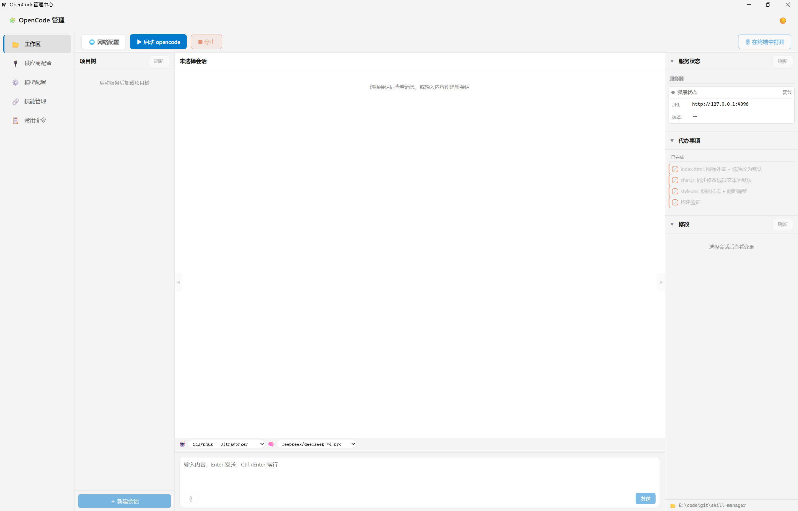

### 6.2 启动 OpenCode 服务

1. 点击左侧 **📂 工作区**
2. 点击右上角 **▶ 启动 opencode**
3. 状态栏显示「在线」即启动成功
4. 左侧会话树自动加载项目→目录→会话结构

> 如果已有 OpenCode serve 在运行（如 `opencode serve --port 4096`），应用会自动检测并连接。

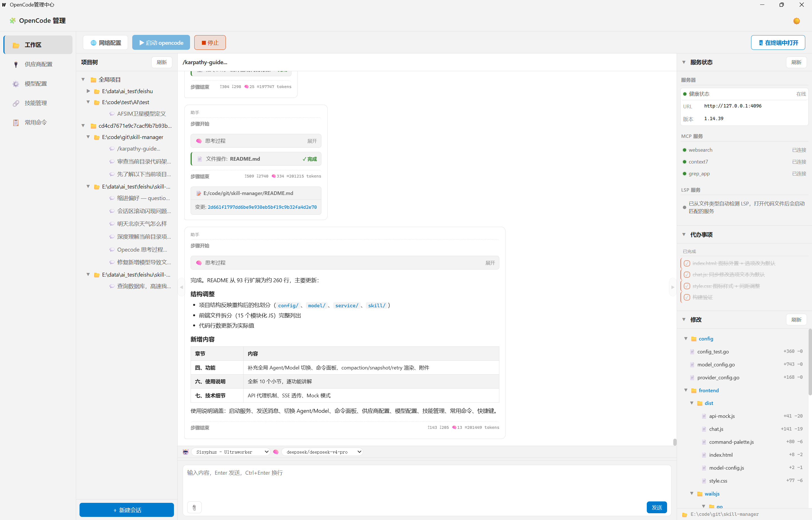


### 6.3 工作区

#### （1）网络配置

网络配置用于配置opencode服务地址，同时支持配置代理

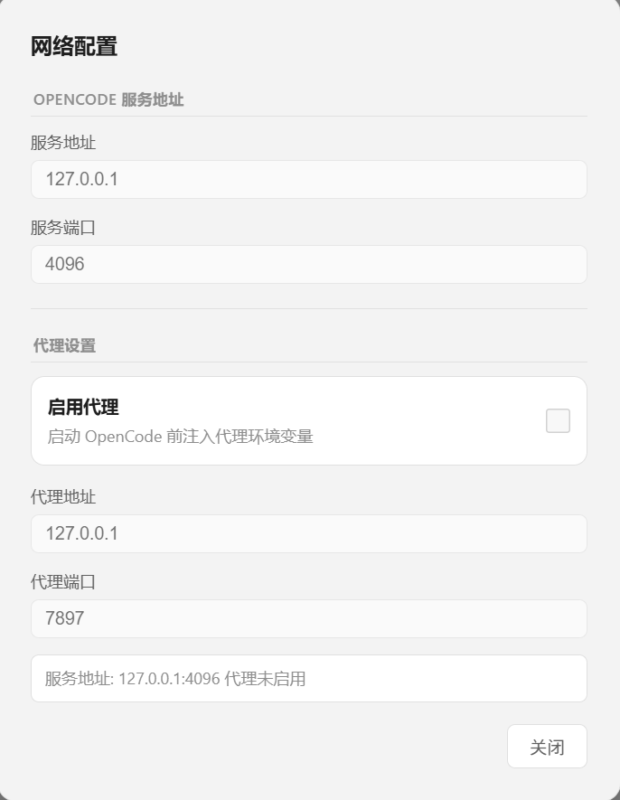

#### （2）项目树

项目树支持按项目分类显示已有会话记录，支持删除和新建会话

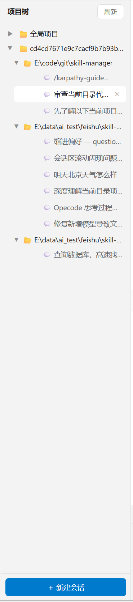

#### （3）会话区

会话区参考主流聊天软件，左侧为模型回复，右侧为用户输入，并通过不同颜色区分。模型回复采用卡片式展示，对不同的操作进行分类展示。

消息显示时，对于思考过程，文件操作，工具调用等默认折叠

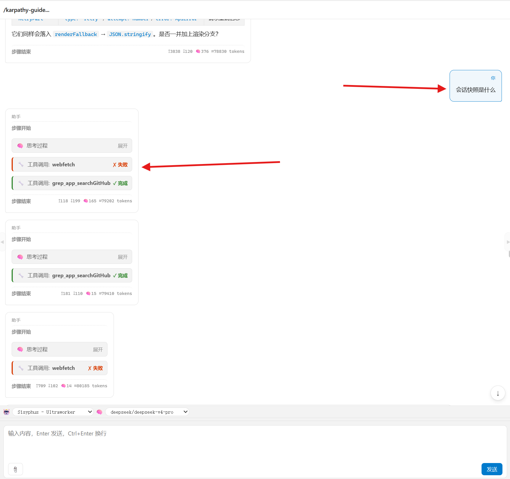

展开思考过程和其他操作

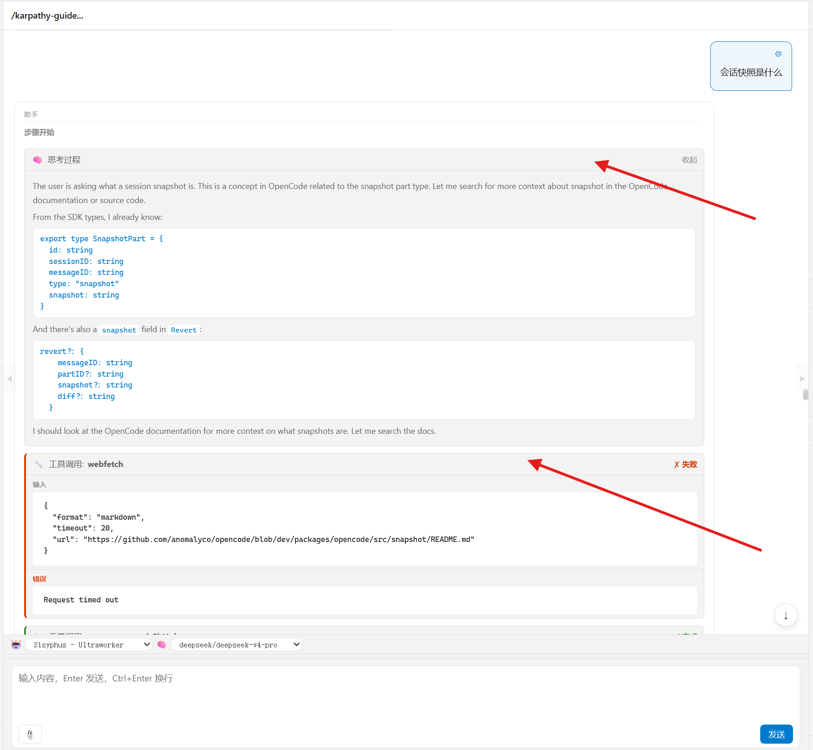

模型输出采用markdown渲染，清晰明了

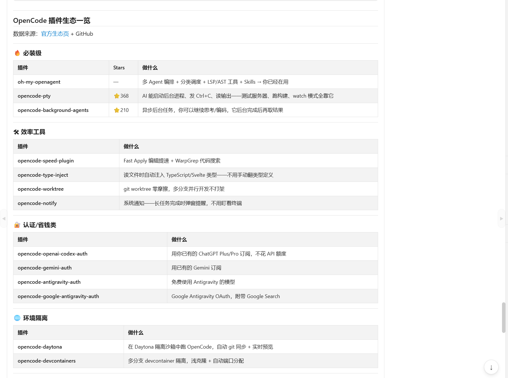

对于提问类进行特殊渲染

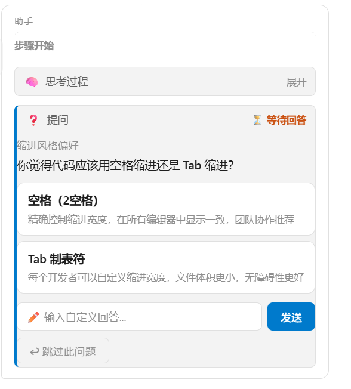

#### （4）Agent / Model选择

消息输入区上方有两个下拉选择器：

- **🤖 代理**：选择使用的 OpenCode Agent（build / plan / general / explore 等）
- **🧠 模型**：选择使用的 AI 模型（格式 `provider/modelID`，如 `deepseek/deepseek-v4-pro`）

选择「默认」表示不强制指定，由 OpenCode 配置文件决定。发送消息时，选中值会作为 `agent` 和 `model` 参数传给 OpenCode。接收到的新消息会自动同步下拉框到实际使用的值。

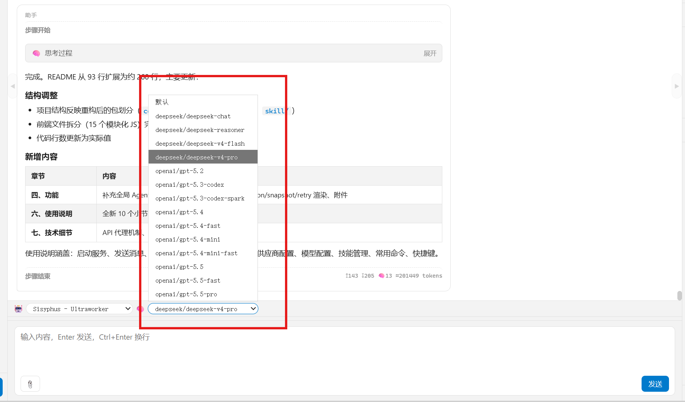


#### （5）消息输入

1. 在底部输入框输入消息
2. 按 **Enter** 发送（Ctrl+Enter / Shift+Enter 换行）

在输入框输入 `/` 弹出命令面板：

| 命令 | 说明 |
|------|------|
| `summarize` | 压缩会话上下文（减少 token 消耗） |
| `revert` | 撤销最后一条 assistant 消息（需 Git 仓库） |
| `unrevert` | 重做撤销 |
| 其他命令 | 从 OpenCode serve 动态获取 |

上/下箭头选择，Enter 或 Tab 确认。前三个固定命令选中后直接执行，其他命令插入输入框供进一步编辑。

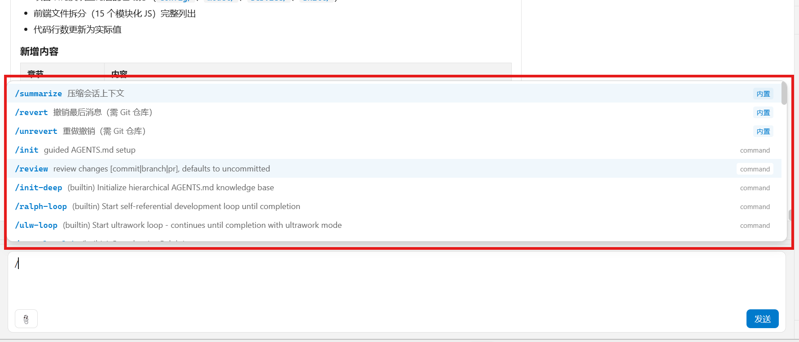

#### （6）状态显示

状态显示区能够显示，当前服务连接状态、代办事项、以及文件修改

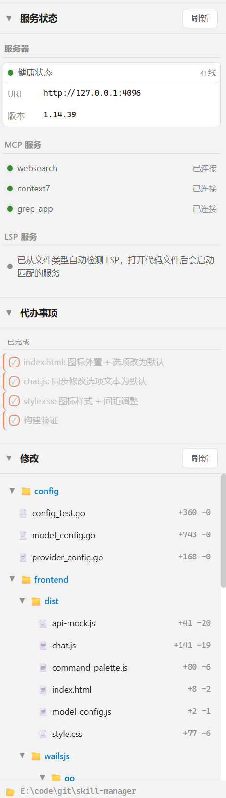

### 6.7 供应商配置

点击左侧 **🔌 供应商配置**：

- 查看/编辑 API 地址、密钥、启用状态
- 管理各供应商的模型列表
- 点击 **💾 保存** 写入 `opencode.jsonc`

### 6.8 模型配置

点击左侧 **⚙️ 模型配置**：

- 按 agent / category 分组，配置每个条目的对应模型
- 支持批量选择 → 批量设置模型
- 可新增/删除 agents 和 categories 条目
- 点击 **💾 保存** 写入 `oh-my-openagent.jsonc`

### 6.9 技能管理

点击左侧 **🔗 技能管理**：

- 查看所有可用技能及其多平台链接状态
- 点击开关 toggle 个别技能的符号链接
- 点击「全部启用/禁用」批量操作
- 支持 OpenCode、Claude Code、Codex 多目标

### 6.10 常用命令

点击左侧 **📋 常用命令**：

- 分 TAB 查看 CLI 命令和 TUI 命令
- CLI：非交互式运行、会话导出、模型列表等
- TUI：快捷键操作（压缩、撤销、模型切换等）

### 6.11 快捷键

| 操作 | 快捷键 |
|------|--------|
| 发送消息 | Enter |
| 换行 | Ctrl+Enter / Shift+Enter |
| 关闭命令面板 | Esc |

---

## 七、技术细节

### API 代理

前端通过 `ocApi(method, path, body)` → `service.OpenCodeAPI()` → 透传到 `http://host:port/path`。Go 后端是通用代理，不限制可调用的端点。

### SSE 事件流

`service/sse.go` 连接 OpenCode 的 `/global/event` SSE 端点，每行 `data:` 原样 `EventsEmit` 到前端。前端 `chat.js` 按事件 type 分发处理。

### Mock 模式

`api-mock.js` 中的 Proxy 对象自动检测 Wails 是否就绪：
- **Wails 就绪** → 调用真实 Go 后端 API
- **否则** → 使用内置 mock 数据

浏览器直接打开 `index.html` 即可预览 UI，无需 Go 后端。<｜end▁of▁thinking｜>

<｜｜DSML｜｜tool_calls>
<｜｜DSML｜｜invoke name="todowrite">
<｜｜DSML｜｜parameter name="todos" string="false">[{"priority":"high","status":"completed","content":"README 更新：项目结构、功能列表、使用说明"}]
