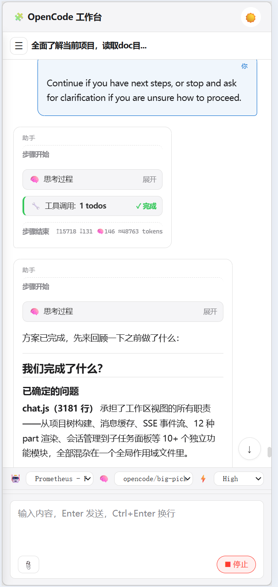
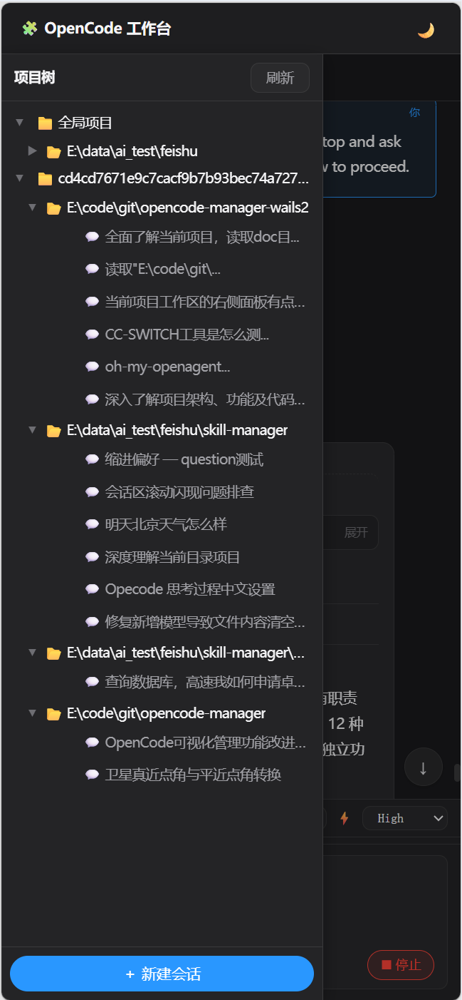
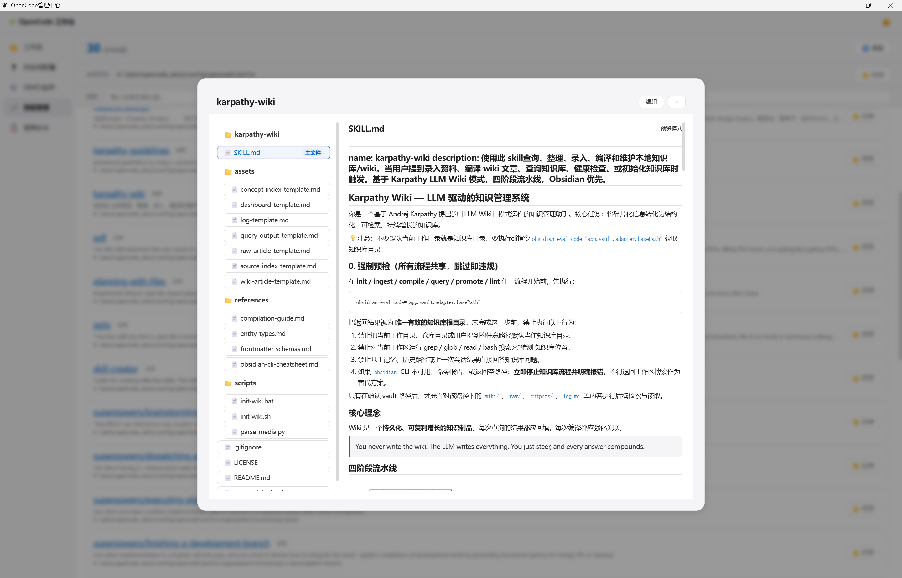
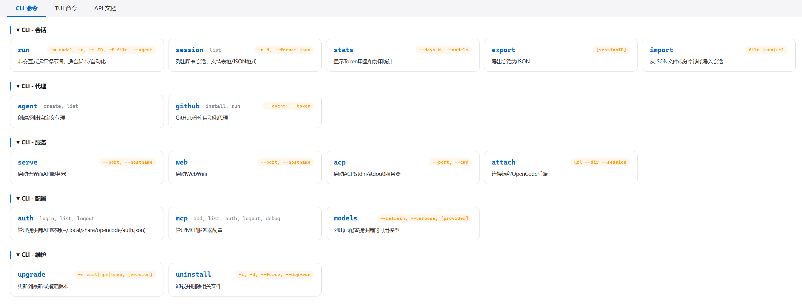
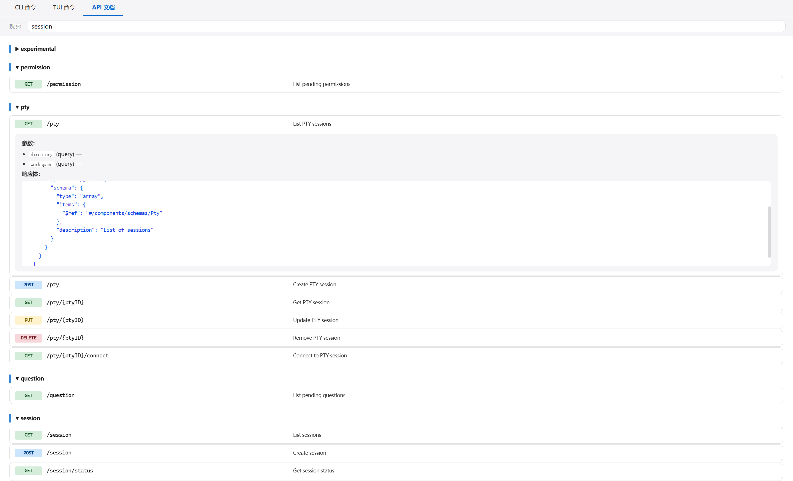

# OC Manager 使用说明

## 目录

- [1. 启动应用](#1-启动应用)
- [2. 工作区](#2-工作区)
  - [2.1 启动 OpenCode 服务](#21-启动-opencode-服务)
  - [2.2 网络配置](#22-网络配置)
  - [2.3 WEB服务配置](#23-web服务配置)
  - [2.4 项目树](#24-项目树)
  - [2.5 站内文件浏览器](#25-站内文件浏览器)
  - [2.6 会话区](#26-会话区)
  - [2.7 消息输入与命令面板](#27-消息输入与命令面板)
  - [2.8 模型选择](#28-模型选择)
  - [2.9 右侧状态面板](#29-右侧状态面板)
- [3. 供应商配置](#3-供应商配置)
- [4. OMO 配置](#4-omo-配置)
- [5. 技能管理](#5-技能管理)
- [6. 项目配置管理](#6-项目配置管理)
- [7. 常用命令](#7-常用命令)
- [8. 快捷键](#8-快捷键)

---

## 1. 启动应用

双击 `oc-manager.exe` 启动桌面应用。界面支持浅色 / 深色主题一键切换（右上角 🌙 按钮）。

> 

也可以通过浏览器访问 Web 端（启动桌面应用后，点击 🌍 Web服务 配置端口，然后在浏览器打开对应地址）。

---

## 2. 工作区

### 2.1 启动 OpenCode 服务

1. 点击左侧 **📂 工作区**
2. 点击顶部 **▶ 启动 OpenCode**
3. 状态栏显示「在线」即启动成功
4. 左侧会话树自动加载项目→目录→会话结构

> 如果已有 OpenCode serve 在运行（如 `opencode serve --port 4096`），应用会自动检测并连接。

> 
> 

### 2.2 网络配置

配置 OpenCode 服务地址（默认 `127.0.0.1:4096`），同时支持 HTTP 代理设置。

  

### 2.3 WEB 服务配置

自由开启web服务，启动后可在浏览器中使用，手机端使用，针对手机端专门进行性能优化和UI适配。三端完全同步，这意味着你可以在工位上用桌面端，走到会议室用 iPad 继续，休息时使用手机查看进度，完全不中断工作流。

  
  

### 2.4 项目树

左侧面板以三级树形展示：**项目 → 目录 → 会话**。

- 点击会话名快速切换
- 悬停显示会话详情（标题、目录、更新时间）
- 每个项目右侧 `+` 按钮可指定目录新建会话
- 每个会话右侧 `✕` 按钮可删除会话
- 支持面板折叠（◀ 按钮）和宽度拖拽调整

  

### 2.5 站内文件浏览器

每个目录条目右侧 `📂` 按钮可打开内置文件浏览器弹窗，支持文件预览、Git 版本管理和文件上传/删除。

#### 文件模式

- 左侧采用**懒加载文件树**：首次显示根目录，点击目录节点展开/折叠并按需加载该目录下一层
- 点击文件夹节点会高亮该目录，并作为上传/新建文件夹的当前目标目录
- 顶部保留 **🔄 刷新** 重新加载根目录树，**✕** 关闭弹窗
- 浏览面板宽度可拖拽调整
- 预览区显示文件名、大小、MIME 类型，支持文本/代码（语法高亮）、Markdown 渲染、HTML 预览、图片预览、PDF 预览
- 点击 **⬇ 下载** 下载当前预览文件

> 

#### Git 模式

- 点击 **🔀** 切换到 Git 变更面板
- **当前变更**：已暂存 / 未暂存文件列表，逐文件查看 diff
- 全部暂存 → 输入提交信息 → **提交**
- 拉取 / 推送按钮同步远端仓库（自动使用网络配置中的代理）
- **提交历史**：分页加载，点击展开查看变更文件，点击文件查看历史 diff

> 

#### 上传与删除

- 左侧底部 **⬆上传文件** 选择文件上传到当前目录
- 同名文件弹窗选择覆盖或重命名
- 每个文件/目录右侧 **✕** 按钮删除，删除前确认

> 

### 2.6 会话区

#### 消息展示

- **用户消息**：右对齐，accent 蓝色边框
- **模型回复**：左对齐，白色卡片，按内容类型分类折叠

#### 折叠分类

| 类型 | 说明 |
|---|---|
| 🧠 思考过程 | 模型推理链，默认折叠，点击展开 |
| 📄 文件操作 | 读/写/编辑文件，显示路径+内容 |
| 🔧 工具调用 | 各工具执行状态（运行中/完成/失败） |
| 📝 模型输出 | Markdown 渲染，支持代码块/表格/列表 |

  
  

#### Markdown 渲染

模型输出支持完整 Markdown 渲染：标题层级、代码高亮、表格、引用块、列表、图片等。

  

#### 提问交互

AI 提问类消息特殊渲染：选项按钮 + 自定义输入 + 跳过，点击选项或输入后自动发送回答。

  

### 2.7 消息输入与命令面板

#### 输入

- **Enter** 发送消息（移动端 Enter 换行）
- **Ctrl+Enter / Shift+Enter** 换行（移动端直接 Enter 换行）
- 支持附件（📎 按钮 / 粘贴图片文件 / 拖拽文件）
- 输入框高度可拖动调整（拖动条双击恢复默认）

#### 命令面板

输入 `/` 弹出命令面板：

| 命令 | 说明 |
|---|---|
| `summarize` | 压缩会话上下文 |
| `revert` | 撤销最后一条消息 |
| `unrevert` | 重做撤销 |
| 其他 | 从 OpenCode serve 动态获取 |

↑↓ 选择，Enter / Tab 确认。固定命令直接执行，其他命令插入输入框待编辑。

> 

### 2.8 模型选择

消息输入区上方三个下拉选择器：

- **🤖 代理**：选择 OpenCode Agent（build / plan / general 等）
- **🧠 模型**：选择 AI 模型（如 `deepseek/deepseek-v4-pro`）
- **⚡ Variant**：推理深度（Minimal → Max）

选择「默认」由 OpenCode 配置文件决定。发送消息时选中值作为参数传入。

> 

### 2.9 右侧状态面板

右侧面板实时显示：服务连接状态、子任务列表（点击查看详情弹窗）、待办事项、文件变更 diff。

- **服务状态**：显示 OpenCode 健康状态、URL、当前版本，并提供 **检查更新** 按钮；点击后通过 Toast 提示是否已是最新版本，若不是则显示最新版本号
- **子任务 / 代办事项 / 修改**：位于独立可滚动内容区
- **当前目录**：固定在右侧底部，不再被上方卡片内容遮挡

  

---

## 3. 供应商配置

点击左侧 **🔌 供应商配置**：

1. 查看/编辑各供应商的 Key、名称、请求地址、API Key、接口格式
2. **手动添加模型**：ID + 名称
3. **📡 获取模型列表**：自动调用供应商 `/models` API，弹出列表选择
4. 点击 **💾 保存** 写入 `opencode.jsonc`

> 
---

## 4. OMO 配置

点击左侧 **⚙️ OMO 配置**：

1. 按 **agent / category** 分组，配置每个条目的模型映射
2. 批量选择 → 批量设置模型
3. 可新增 / 删除 agents 和 categories 条目
4. 方案管理：**导出**（到文件）、**导入**（从文件）、**入库**（保存到方案目录）、下拉切换方案即时预览

> 

---

## 5. 技能管理

点击左侧 **🔗 技能管理**：

1. **添加来源目录**：选择包含技能的文件夹，支持 SKILL.md 自动校验
2. **技能列表**：来源标签 + 冲突检测 + 启用/禁用 toggle
3. **技能方案**：保存当前启用状态为方案 → 一键应用方案切换
4. **文件浏览**：点击技能名打开内置浏览器，预览/编辑 SKILL.md 及附属文件

> 嵌套技能（如 `superpowers/using-git-worktrees`）自动取顶层文件夹做链接，所有子技能一并启用。

> 
> 

---

## 6. 项目配置管理

点击左侧项目树中目录条目的 ⚙️ 按钮，或从工作区目录栏进入项目配置弹窗。集中管理 `.opencode/` 下的所有项目级配置。

> 

### 6.1 核心配置

查看和编辑 `.opencode/opencode.jsonc`（或 `opencode.json`）。

- 语法高亮预览（JSON）
- 点击 **编辑** 进入编辑模式，**Ctrl+S** 保存
- 没有项目配置文件时，可点击 **查看全局配置** 参考全局 `~/.config/opencode/opencode.jsonc`

### 6.2 技能管理

管理 `.opencode/skills/` 目录下的项目级技能。

- **技能列表**：卡片式展示技能名称和描述，点击 **查看** 浏览技能文件目录
- **删除技能**：每个条目右侧 `✕` 删除（软链接使用安全删除，不跟随到目标目录）
- **导入技能**：点击 **导入技能** 弹窗，从全局来源目录扫描可导入技能
  - **已导入**：灰色标签置灰，不可重复导入
  - **全局已有**：黄色提示标签，仍可导入
  - 导入使用**软链接**方式，与全局技能管理一致
- **嵌套技能**：支持多级目录结构（如 `superpowers/brainstorming`）

### 6.3 项目准则

查看和编辑项目根目录的 `AGENTS.md`。

- Markdown 渲染预览
- 点击 **编辑** 进入纯文本编辑模式
- 没有 AGENTS.md 时提示先执行 `/init` 初始化项目

### 6.4 用户命令

管理 `.opencode/commands/` 目录下的自定义命令（`.md` 文件）。

- 文件列表浏览，点击文件进入预览/编辑
- **+ 新增** 按钮创建新命令文件（自动补全 `.md`）
- 每个文件右侧 `✕` 删除

### 6.5 用户规则

管理 `.opencode/rules/` 目录下的规则文件。

- 文件列表浏览，点击文件进入预览/编辑
- **+ 新增** 创建新规则文件，**✕** 删除

### 6.6 预览与编辑

所有文件打开默认进入**预览模式**：

| 文件类型 | 预览方式 |
|----------|----------|
| `.md` | Markdown 渲染（与聊天区一致） |
| `.json` / `.jsonc` | 代码高亮 + 行号 |
| 其他文本 | 自动检测语言并高亮 |

点击 **编辑** 进入编辑模式（纯文本 textarea），点击 **预览** 回到预览模式，**Ctrl+S** 保存。

---

## 7. 常用命令

点击左侧 **📋 常用命令**：

- **CLI 命令**：非交互式运行、会话导出/导入、模型列表等
- **TUI 命令**：快捷键大全（压缩、撤销、模型切换等）
- **API 文档**：支持搜索过滤

> 
> 

---

## 8. 快捷键

| 操作 | 桌面端 | 移动端 |
|---|---|---|
| 发送消息 | Enter | 按钮 |
| 换行 | Ctrl+Enter / Shift+Enter | Enter |
| 命令面板 | `/` | `/` |
| 关闭面板 | Esc | 点遮罩 |
